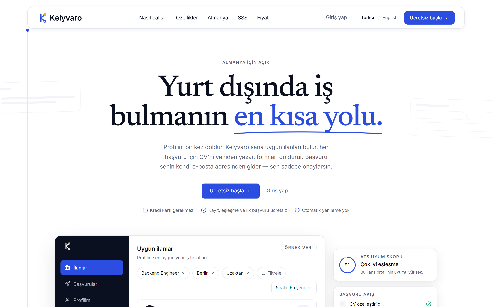
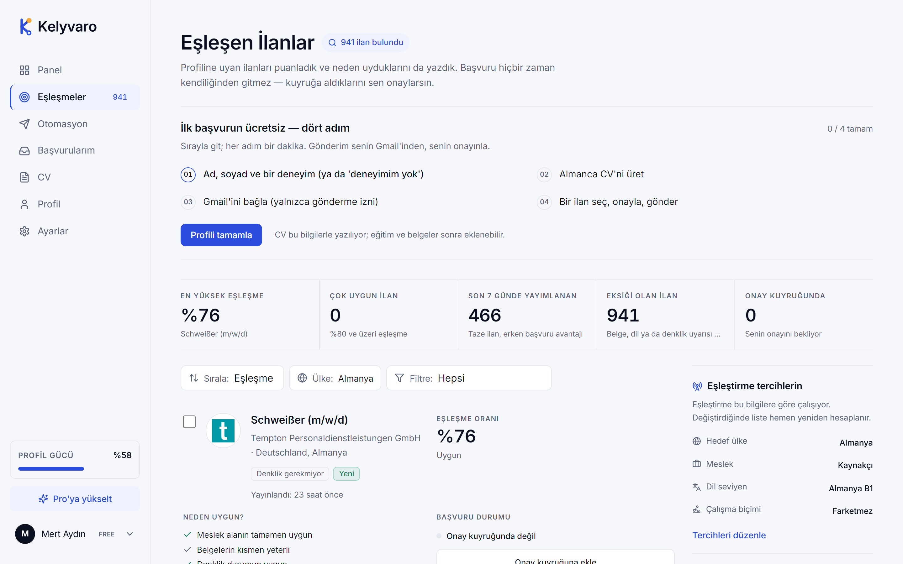
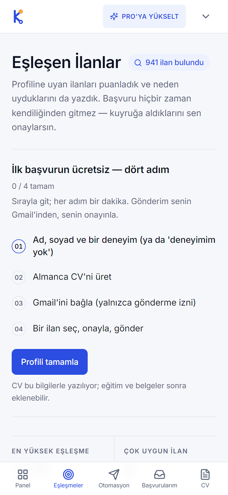
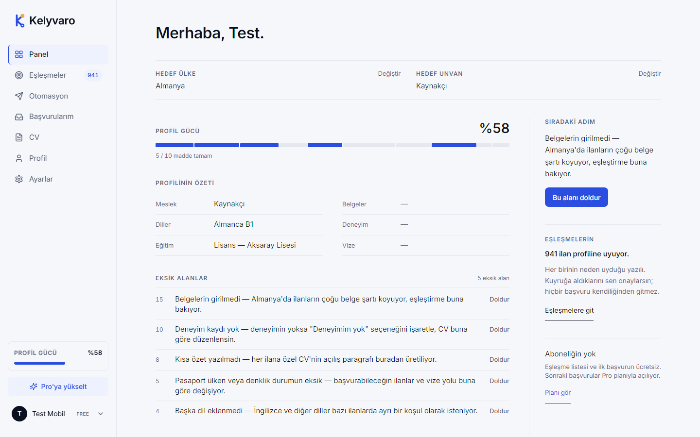
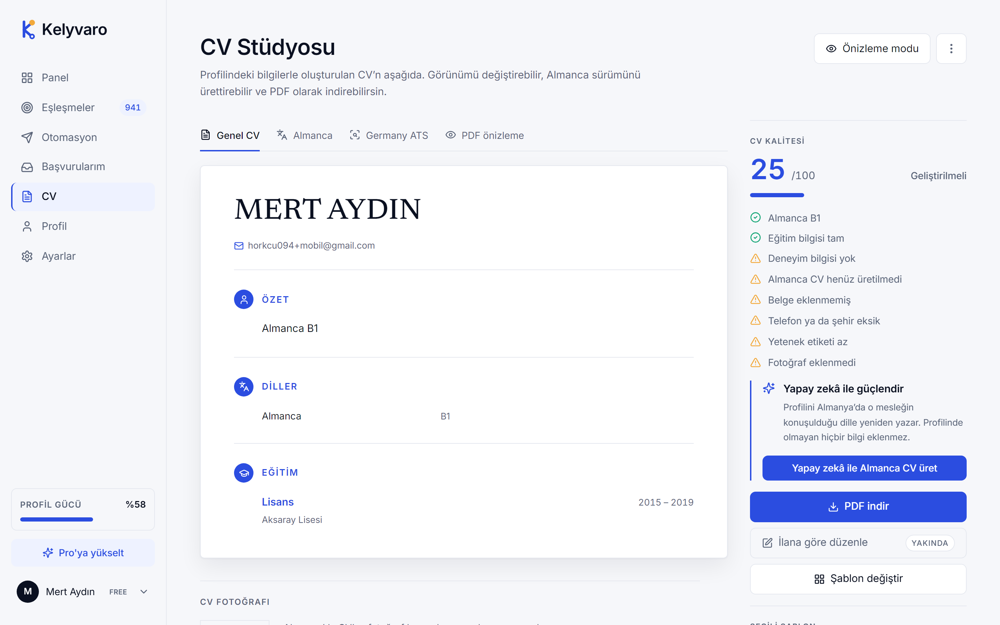
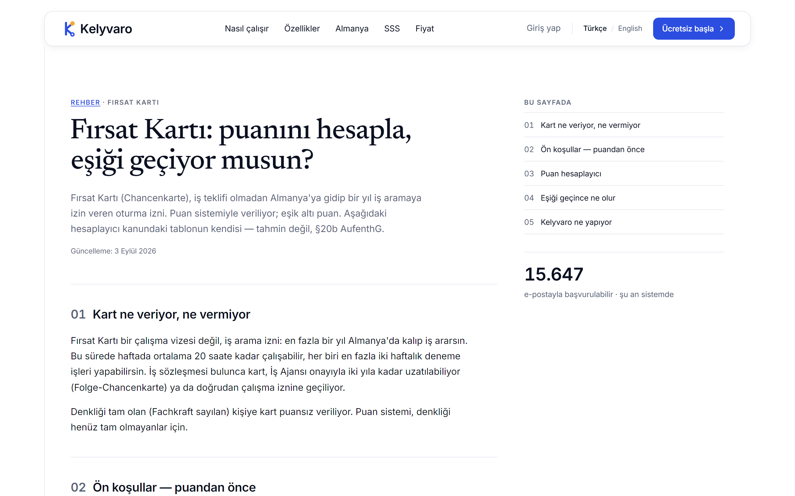
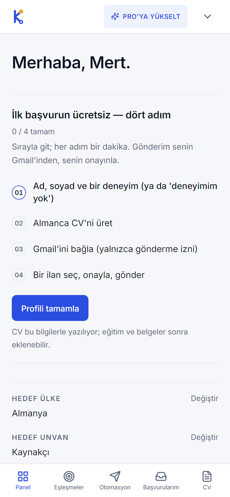
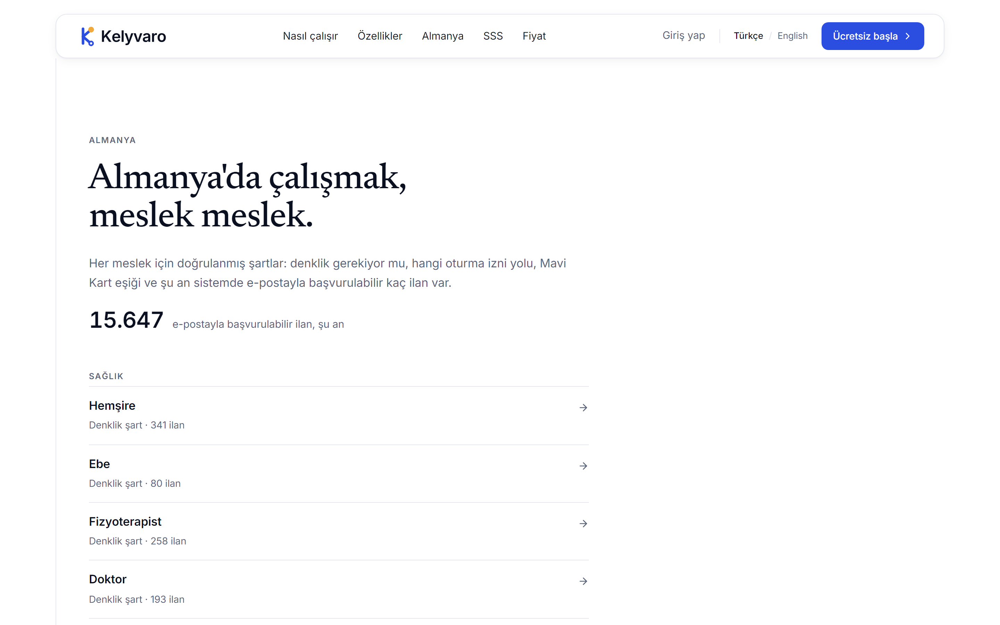
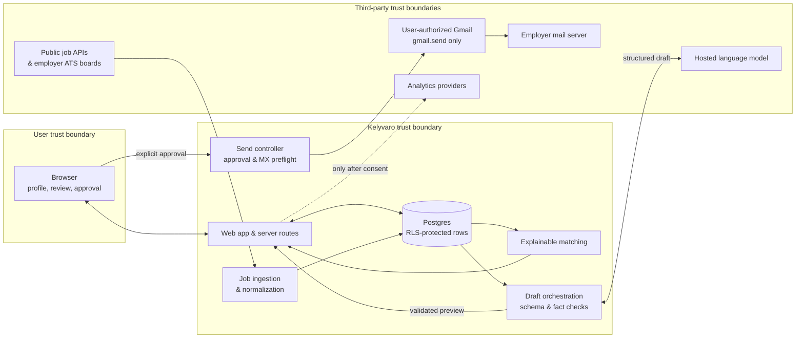

# Kelyvaro

### Apply to jobs in Germany from your own e-mail — with a tailored German CV for every posting.

Profile once. Matched postings from employer career sites. An ATS-ready Lebenslauf and Anschreiben per posting.
**You approve every application; nothing is sent without you.**

[**kelyvaro.com**](https://kelyvaro.com) · Turkish & English · Germany first

 

---

## What it does

Turkish job seekers — welders, electricians, truck drivers, nurses, cooks, engineers — usually pay an intermediary thousands of euros up front to reach a German employer. Kelyvaro is the tool instead of the intermediary.

| Step | What happens |
|---|---|
| **Profile** | Target country, occupation and German level open your list in under a minute; the rest is only needed for the CV. |
| **Matching** | Postings from Adzuna and employer applicant-tracking boards (Personio, SmartRecruiters, Greenhouse, Workday, Oracle, softgarden …) are scored against your profile — with the *reasons* shown, not just a number. |
| **CV & letter** | For each posting, a German tabular Lebenslauf and a DIN 5008 Anschreiben are generated. The model drafts from profile facts; structured output and grounding checks run before preview. |
| **Sending** | The mail goes from **your own Gmail** (send-only permission). It stays in your Sent folder; the employer replies to you. |
| **Tracking** | Sent applications and user-recorded outcomes in one place; replies stay in Gmail. |

No job guarantee, no placement, no hidden fees. The first application is free; then a single monthly payment, no auto-renewal.

---

## Product

<table>
<tr>
<td width="66%"></td>
<td width="34%"></td>
</tr>
<tr>
<td colspan="2" align="center"><b>Matches.</b> Every row explains why it fits; a four-step guide walks a new user to the first free application. All traffic is mobile, so the mobile layout is the primary one.</td>
</tr>
</table>

<table>
<tr>
<td width="50%"></td>
<td width="50%"></td>
</tr>
<tr>
<td align="center"><b>Dashboard.</b> Profile strength is the only score shown — it is computed, not decorative.</td>
<td align="center"><b>CV studio.</b> Missing inputs are listed before anything is generated.</td>
</tr>
</table>

<table>
<tr>
<td width="60%"></td>
<td width="40%"></td>
</tr>
<tr>
<td align="center"><b>Guides.</b> Seven guides on German CVs, recognition (Anerkennung), the EU Blue Card and the Opportunity Card — including a points calculator built from the text of the law (§20a/§20b AufenthG).</td>
<td align="center"><b>Mobile dashboard.</b></td>
</tr>
</table>

<b>Occupation index.</b> 46 occupations with verified requirements (recognition, visa route, salary thresholds) and live posting counts.

---

## Under the hood

- **Next.js 15** (App Router, TypeScript strict) · **Tailwind v4** · **next-intl** (tr/en)
- **Supabase** (Postgres, RLS on every table, pg_cron) · **Vercel** (Frankfurt region)
- **Job sources:** Adzuna API, Arbeitnow, and an employer ATS registry; the generic discovery and reader layer is open-sourced as [ats-boards](https://github.com/msertdev/ats-boards) (12 providers)
- **Generation:** Groq-hosted open-weight model with structured JSON output; profile-grounding checks before preview and prompt regression tests with promptfoo
- **Sending:** Gmail API with the least-privilege `gmail.send` scope; an MX preflight checks recipient-domain mail routing before send
- **Measurement:** GA4 + Meta CAPI + PostHog (EU), all behind explicit consent
- **Video:** launch spots rendered with Remotion from the same design tokens as the site

Design language is editorial rather than "SaaS template": Newsreader headings, Inter body, ink-and-paper palette, lines instead of cards, one accent used sparingly.

---

## Engineering case study

The core engineering constraint is trust: an application contains personal career data, AI-generated language and an outbound message in the user's name. Kelyvaro automates discovery and drafting, but keeps identity, approval and final sending under the user's control.

### Decisions and trade-offs

| Decision | Guardrail | Trade-off |
|---|---|---|
| Keep a human in the send loop | Every generated document is previewed; sending requires explicit approval | More user effort, but no autonomous application in the user's name |
| Treat the profile as the factual source of truth | Structured output is checked against profile data before preview; prompt regressions are tested | Conservative copy and occasional regeneration instead of silently accepting unsupported claims |
| Isolate user data at the database boundary | Row-level security is enabled on every application table | More policy and test maintenance, stronger defence if an application query is wrong |
| Ask Gmail only for send access | `gmail.send` can send the approved message without inbox-read permission | Replies remain in Gmail and outcome tracking cannot depend on reading the inbox |
| Prefer source fidelity over invented completeness | ATS readers normalize only fields returned by public employer boards and use conservative Germany filtering | Some incomplete postings remain incomplete or may not match as strongly |
| Measure only after consent | Product and marketing analytics are gated behind an explicit choice | Less complete funnels in exchange for a clearer privacy boundary |

An MX result only confirms that a domain publishes mail-routing records; it is a preflight, not a guarantee that a mailbox exists or that delivery will succeed.

### What I own

I own Kelyvaro's product and engineering lifecycle: product/technical direction, application architecture, data model and RLS policies, job ingestion and explainable matching, generation guardrails, Gmail send flow, responsive UX and localization, deployment and production operation. My co-founder owns distribution.

### Public evidence

- [Live beta](https://kelyvaro.com) and the repository's [matching](./masaustu-eslesmeler.png), [CV studio](./masaustu-cv.png) and [mobile](./mobil-ana.png) captures document the shipped user flows.
- [ats-boards](https://github.com/msertdev/ats-boards) contains the reusable ATS discovery/reader layer, provider verification notes, normalized posting contract and offline tests.
- [Repository history](https://github.com/msertdev/kelyvaro-showcase/commits/main/) records the evolution of this public showcase.

The production repository and customer data are private. This diagram deliberately shows responsibilities and trust boundaries, not secrets, internal endpoints or deployable implementation details.

---

## Status

Live beta since August 2026. Built and operated by [Murat Sert](https://github.com/msertdev); a co-founder leads distribution.

Screenshots use a sample profile ("Mert Aydın"); no user data is shown.

© 2026 Kelyvaro. Screenshots and text in this repository are provided for reference only (see LICENSE).
