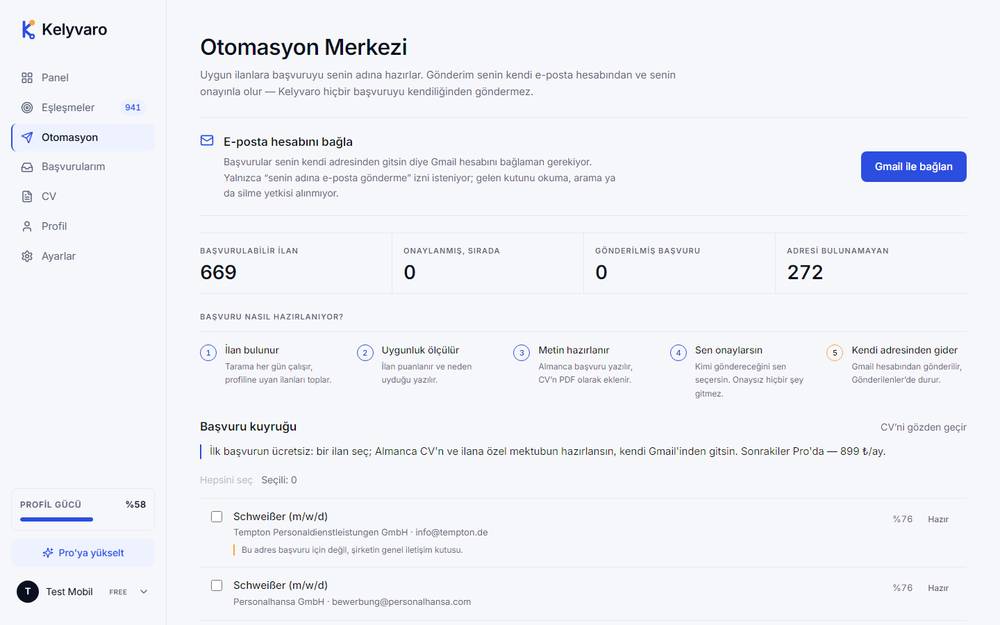
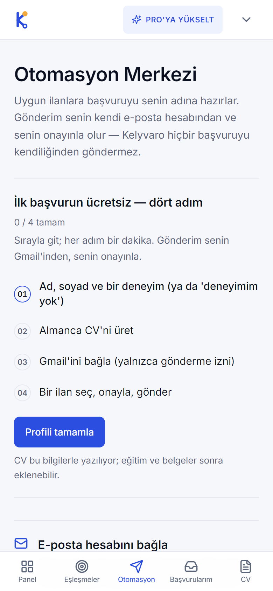
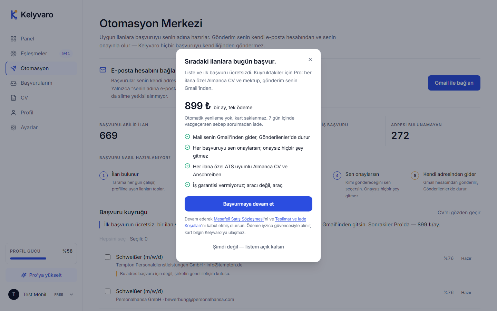

# Kelyvaro

### AI-powered job application platform for international professionals.

Find relevant opportunities.  
Prepare tailored applications.  
Stay in control of the entire process.

[**Visit Kelyvaro →**](https://kelyvaro.com)

 

 

---

## About Kelyvaro

Finding a job abroad shouldn't mean repeating the same application work hundreds of times.

**Kelyvaro** brings job discovery, matching, application preparation and tracking into one streamlined workflow.

Build your profile once. Kelyvaro helps prepare the rest.

### What Kelyvaro helps with

- 🔎 Discover relevant job opportunities
- 🎯 Match vacancies with candidate profiles
- 📄 Prepare tailored, ATS-ready CVs
- ✍️ Generate role-specific application material
- ⚙️ Reduce repetitive application work
- ✅ Keep the candidate in control before submission
- 📊 Track applications from one workspace

---

## Product Experience

### Your application workspace

Manage opportunities, applications and your profile from one central dashboard.

 

### Smart job matching

Kelyvaro helps surface opportunities that fit the candidate's experience, preferences and profile.

 

### Application automation

Repetitive preparation work can be streamlined while the candidate keeps final control.

 

### Guided application flow

Candidates can move through the application process with a clear, structured workflow.

 

### Everything in one place

A unified workspace for managing the journey from opportunity discovery to application.

---

## How It Works

### 01 — Create your profile

Add your professional information, experience, preferences and application details once.

### 02 — Discover opportunities

Kelyvaro helps identify relevant opportunities based on the candidate profile.

### 03 — Prepare applications

Application material can be adapted to the requirements of individual vacancies.

### 04 — Review

The candidate reviews the prepared application before proceeding.

### 05 — Track progress

Applications stay organised in one place throughout the process.

---

## Product Principles

Kelyvaro is designed around a simple idea:

> **Automate repetitive work — not important decisions.**

Technology handles preparation and organisation.

The candidate stays in control.

---

## Current Focus

🇩🇪 Germany-focused job opportunities  
🤖 AI-assisted application workflows  
📄 ATS-friendly application preparation  
🌍 International professionals  
⚡ Faster and more organised applications  

---

## Built By

### Murat Sert

Founder & Developer of **Kelyvaro**

`AI` · `Automation` · `Full-Stack Development` · `Product Development`

[GitHub](https://github.com/msertdev) ·
[LinkedIn](https://www.linkedin.com/in/kelyvaro/) ·
[Instagram](https://www.instagram.com/kelyvaro_/) ·
[Website](https://kelyvaro.com)

---

## Kelyvaro

**A shorter path from profile to application.**

[**kelyvaro.com →**](https://kelyvaro.com)

